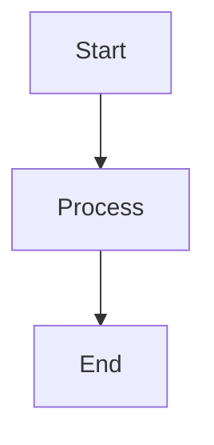

# Hướng dẫn nhanh - Osstech Wiki

## 🚀 Chạy dự án

### Development mode (chế độ phát triển)
```bash
npm run start
```
Mở trình duyệt tại: http://localhost:3000

### Production build (build để deploy)
```bash
npm run build
npm run serve
```

## 🔍 Cấu hình Tìm kiếm

1. Đọc file `SEARCH-SETUP.md` để biết cách đăng ký Algolia DocSearch
2. Sau khi có thông tin từ Algolia, mở `docusaurus.config.js`
3. Tìm phần `algolia` (đang bị comment) và uncomment, điền thông tin:
   ```javascript
   algolia: {
     appId: 'YOUR_APP_ID',
     apiKey: 'YOUR_API_KEY',
     indexName: 'YOUR_INDEX_NAME',
     contextualSearch: true,
     searchParameters: {},
     searchPagePath: 'search',
   },
   ```
4. Build lại: `npm run build`

## 📊 Sử dụng Mermaid để vẽ sơ đồ

Mermaid đã được cài đặt và sẵn sàng sử dụng!

### Ví dụ cơ bản:
````markdown

````

### Xem thêm ví dụ:
- Mở file `docs/mermaid-examples.md` để xem các ví dụ đầy đủ
- Hoặc truy cập: https://mermaid.js.org/ để xem tất cả loại sơ đồ

### Các loại sơ đồ hỗ trợ:
- Flowchart (Lưu đồ)
- Sequence Diagram (Sơ đồ trình tự)
- Class Diagram (Sơ đồ lớp)
- State Diagram (Sơ đồ trạng thái)
- Gantt Chart (Biểu đồ Gantt)
- Network/Infrastructure Diagram (Sơ đồ mạng)

## 🚢 Deploy với PM2

### Cấu hình PM2
File `ecosystem.config.js` đã được cấu hình sẵn.

### Chạy với PM2:
```bash
pm2 start ecosystem.config.js
```

### Quản lý:
```bash
pm2 list              # Xem danh sách
pm2 restart osstech-wiki  # Restart
pm2 stop osstech-wiki     # Dừng
pm2 logs osstech-wiki     # Xem logs
```

## 🔄 CI/CD với GitLab

### Bước 1: Cấu hình biến môi trường
Vào GitLab: **Settings > CI/CD > Variables** và thêm:
- `SSH_PRIVATE_KEY`: Private key SSH
- `DEPLOY_USER`: Username SSH (ví dụ: `deploy`)
- `DEPLOY_SERVER`: IP/domain server
- `DEPLOY_PATH`: Đường dẫn deploy (ví dụ: `/var/www/html`)

### Bước 2: Test pipeline
```bash
git add .
git commit -m "Test CI/CD"
git push origin main
```

Vào GitLab: **CI/CD > Pipelines** để xem pipeline chạy.

### Bước 3: Deploy
Sau khi build thành công, click nút "Play" để deploy (nếu dùng manual deploy).

**Xem chi tiết**: `CI-CD-SETUP.md`

## 📝 Viết tài liệu mới

### Thêm file Markdown mới:
1. Tạo file `.md` trong thư mục `docs/`
2. Thêm frontmatter ở đầu file:
   ```markdown
   ---
   sidebar_position: 1
   ---
   ```
3. File sẽ tự động xuất hiện trong sidebar

### Cấu trúc thư mục:
```
docs/
  ├── intro.md
  ├── mermaid-examples.md
  └── tutorial-basics/
      ├── create-a-document.md
      └── ...
```

## 🎨 Tùy chỉnh

### Thay đổi logo:
1. Thay file `static/img/logo.svg`
2. Hoặc cập nhật đường dẫn trong `docusaurus.config.js`

### Thay đổi màu sắc:
Sửa file `src/css/custom.css`

### Thay đổi cấu hình:
Sửa file `docusaurus.config.js` (KHÔNG sửa file trong `.docusaurus/`)

## ⚠️ Lưu ý quan trọng

1. **KHÔNG sửa file trong `.docusaurus/`** - Đây là file tự động generate
2. **Luôn sửa `docusaurus.config.js`** ở thư mục gốc
3. **Chạy `npm run build`** sau mỗi thay đổi config để test
4. **Search chỉ hoạt động sau khi cấu hình Algolia** (xem `SEARCH-SETUP.md`)

## 📚 Tài liệu tham khảo

- [Docusaurus Documentation](https://docusaurus.io/docs)
- [Mermaid Documentation](https://mermaid.js.org/)
- [Algolia DocSearch](https://docsearch.algolia.com/)
- [GitLab CI/CD](https://docs.gitlab.com/ee/ci/)

## 🆘 Troubleshooting

### Build lỗi?
- Chạy `npm install` lại
- Xóa thư mục `build/` và `.docusaurus/`
- Chạy `npm run build` lại

### Search không hiển thị?
- Đảm bảo đã cấu hình Algolia (xem `SEARCH-SETUP.md`)
- Build lại project: `npm run build`

### Mermaid không render?
- Đảm bảo đã cài `@docusaurus/theme-mermaid`
- Kiểm tra syntax Mermaid có đúng không
- Xem ví dụ trong `docs/mermaid-examples.md`

