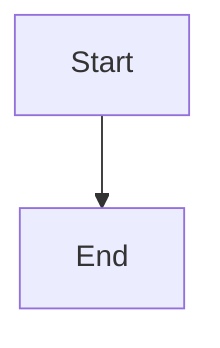

# Osstech Wiki - Trang Tài Liệu Nội Bộ

Trang tài liệu nội bộ của Osstech Team được xây dựng bằng [Docusaurus](https://docusaurus.io/) - một static website generator hiện đại.

## ✨ Tính năng

- 🔍 **Tìm kiếm**: Tích hợp Algolia DocSearch (cần cấu hình)
- 📊 **Sơ đồ Mermaid**: Vẽ sơ đồ kiến trúc, flowchart, sequence diagram ngay trong Markdown
- 🚀 **CI/CD tự động**: Deploy tự động qua GitLab CI/CD
- 📱 **Responsive**: Tối ưu cho mọi thiết bị
- 🌙 **Dark Mode**: Hỗ trợ chế độ sáng/tối

## 🚀 Cài đặt

```bash
npm install
```

## 💻 Development

Chạy development server:

```bash
npm run start
```

Mở trình duyệt tại: http://localhost:3000

## 🏗️ Build

Build project để production:

```bash
npm run build
```

Test build locally:

```bash
npm run serve
```

## 📚 Tài liệu

- **[QUICK-START.md](./QUICK-START.md)** - Hướng dẫn nhanh
- **[UPGRADE-SUMMARY.md](./UPGRADE-SUMMARY.md)** - Tóm tắt các cải tiến
- **[SEARCH-SETUP.md](./SEARCH-SETUP.md)** - Hướng dẫn cấu hình tìm kiếm
- **[CI-CD-SETUP.md](./CI-CD-SETUP.md)** - Hướng dẫn cấu hình CI/CD
- **[docs/mermaid-examples.md](./docs/mermaid-examples.md)** - Ví dụ sử dụng Mermaid

## 🚢 Deploy

### Với PM2

```bash
pm2 start ecosystem.config.js
```

### Với GitLab CI/CD

1. Cấu hình biến môi trường trong GitLab (xem `CI-CD-SETUP.md`)
2. Push code lên GitLab
3. Pipeline sẽ tự động build và deploy

## 📝 Viết tài liệu

1. Tạo file `.md` trong thư mục `docs/`
2. Thêm frontmatter:
   ```markdown
   ---
   sidebar_position: 1
   ---
   ```
3. File sẽ tự động xuất hiện trong sidebar

### Sử dụng Mermaid

````markdown

````

Xem thêm ví dụ: [docs/mermaid-examples.md](./docs/mermaid-examples.md)

## ⚙️ Cấu hình

### Tìm kiếm (Search)

Đọc file `SEARCH-SETUP.md` để biết cách cấu hình Algolia DocSearch.

### CI/CD

Đọc file `CI-CD-SETUP.md` để biết cách cấu hình GitLab CI/CD.

## 🛠️ Scripts

- `npm run start` - Chạy development server
- `npm run build` - Build production
- `npm run serve` - Serve build locally
- `npm run clear` - Xóa cache và build files

## 📦 Dependencies

- `@docusaurus/core`: 3.9.2
- `@docusaurus/preset-classic`: 3.9.2
- `@docusaurus/theme-mermaid`: 3.9.2

## ⚠️ Lưu ý

- **KHÔNG sửa file trong `.docusaurus/`** - Đây là file tự động generate
- **Luôn sửa `docusaurus.config.js`** ở thư mục gốc
- **Chạy `npm run build`** sau mỗi thay đổi config

## 📄 License

Tài liệu nội bộ Osstech Team - Không được phát hành công khai.

## 👥 Contributors

Osstech Team

---

Được xây dựng với ❤️ bằng [Docusaurus](https://docusaurus.io/)
