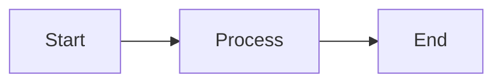

# 🧪 Hướng dẫn Test - Osstech Wiki

## 🚀 Test Nhanh (Development Mode)

### Bước 1: Chạy Development Server

```bash
cd my-internal-portal
npm run start
```

Server sẽ chạy tại: **http://localhost:3000**

Mở trình duyệt và truy cập để xem trang docs.

### Bước 2: Kiểm tra các tính năng cơ bản

#### ✅ Navigation
- [ ] Click vào menu "Tài liệu" - sidebar hiển thị
- [ ] Click vào các link trong sidebar - chuyển trang được
- [ ] Click vào "Blog" - vào trang blog được

#### ✅ Responsive
- [ ] Thu nhỏ cửa sổ trình duyệt - layout tự động điều chỉnh
- [ ] Mở trên mobile (hoặc dùng DevTools mobile mode) - hiển thị đúng

#### ✅ Dark Mode
- [ ] Click vào icon mặt trăng/ mặt trời ở navbar - chuyển dark/light mode được

## 📊 Test Mermaid (Sơ đồ)

### Bước 1: Xem file ví dụ

1. Trong trình duyệt, vào **Tài liệu > Ví dụ sử dụng Mermaid**
2. Hoặc truy cập trực tiếp: http://localhost:3000/docs/mermaid-examples

### Bước 2: Kiểm tra các loại sơ đồ

- [ ] **Flowchart** - Sơ đồ lưu đồ hiển thị đúng
- [ ] **Sequence Diagram** - Sơ đồ trình tự hiển thị đúng
- [ ] **Network Diagram** - Sơ đồ mạng hiển thị đúng
- [ ] **Gantt Chart** - Biểu đồ Gantt hiển thị đúng
- [ ] **Class Diagram** - Sơ đồ lớp hiển thị đúng
- [ ] **State Diagram** - Sơ đồ trạng thái hiển thị đúng

### Bước 3: Test tạo sơ đồ mới

1. Tạo file test: `docs/test-mermaid.md`
2. Thêm nội dung:

````markdown
---
sidebar_position: 99
---

# Test Mermaid


````

3. Lưu file và kiểm tra trong trình duyệt
4. Sơ đồ sẽ tự động render

## 🔍 Test Search (Tìm kiếm)

### Lưu ý:
Search chỉ hoạt động sau khi cấu hình Algolia. Hiện tại search bar sẽ hiển thị nhưng chưa hoạt động.

### Test sau khi cấu hình Algolia:

1. **Kiểm tra search bar hiển thị:**
   - [ ] Icon search xuất hiện ở góc phải navbar
   - [ ] Click vào icon - popup search mở ra

2. **Test tìm kiếm:**
   - [ ] Gõ từ khóa - kết quả hiển thị
   - [ ] Click vào kết quả - chuyển đến trang đúng
   - [ ] Từ khóa được highlight trên trang

## 🏗️ Test Build Production

### Bước 1: Build

```bash
npm run build
```

Kiểm tra:
- [ ] Build thành công không có lỗi
- [ ] Thư mục `build/` được tạo ra
- [ ] Các file HTML, CSS, JS được generate

### Bước 2: Serve build locally

```bash
npm run serve
```

Server sẽ chạy tại: **http://localhost:3000**

Kiểm tra:
- [ ] Trang load được
- [ ] Tất cả links hoạt động
- [ ] Hình ảnh hiển thị đúng
- [ ] Mermaid render đúng
- [ ] Không có lỗi trong console (F12)

### Bước 3: Kiểm tra file build

```bash
# Windows PowerShell
dir build

# Kiểm tra các file quan trọng
dir build\index.html
dir build\docs\intro\index.html
```

## 🚢 Test PM2 (Nếu dùng PM2)

### Bước 1: Build trước

```bash
npm run build
```

### Bước 2: Chạy với PM2

```bash
pm2 start ecosystem.config.js
```

### Bước 3: Kiểm tra

```bash
# Xem danh sách processes
pm2 list

# Xem logs
pm2 logs osstech-wiki

# Kiểm tra status
pm2 status
```

Kiểm tra:
- [ ] Process "osstech-wiki" đang chạy
- [ ] Status là "online"
- [ ] Truy cập http://localhost:3000 - trang load được
- [ ] Không có lỗi trong logs

### Bước 4: Test restart

```bash
pm2 restart osstech-wiki
```

Kiểm tra:
- [ ] Restart thành công
- [ ] Trang vẫn hoạt động sau restart

## 🔄 Test CI/CD với GitLab

### Bước 1: Commit và push code

```bash
git add .
git commit -m "Test CI/CD pipeline"
git push origin main
```

### Bước 2: Kiểm tra trong GitLab

1. Vào GitLab project
2. Vào **CI/CD > Pipelines**
3. Kiểm tra:
   - [ ] Pipeline được tạo ra
   - [ ] Stage "build" chạy
   - [ ] Build thành công (màu xanh)
   - [ ] Artifacts được tạo ra

### Bước 3: Test deploy (nếu đã cấu hình)

1. Sau khi build thành công, click nút **"Play"** ở stage deploy
2. Kiểm tra:
   - [ ] Deploy chạy thành công
   - [ ] File được upload lên server
   - [ ] Trang web trên server được cập nhật

## 🐛 Test Lỗi Thường Gặp

### Test broken links

```bash
npm run build
```

Kiểm tra output - nếu có broken links sẽ báo lỗi.

### Test missing images

1. Mở trang docs trong trình duyệt
2. Kiểm tra:
   - [ ] Tất cả hình ảnh hiển thị
   - [ ] Không có ảnh bị lỗi (icon broken image)

### Test console errors

1. Mở trình duyệt (F12)
2. Vào tab **Console**
3. Kiểm tra:
   - [ ] Không có lỗi JavaScript
   - [ ] Không có warning nghiêm trọng

## 📋 Checklist Test Tổng Quan

### Development Mode
- [ ] `npm run start` chạy được
- [ ] Trang load tại http://localhost:3000
- [ ] Navigation hoạt động
- [ ] Mermaid render đúng
- [ ] Dark mode hoạt động
- [ ] Responsive trên mobile

### Production Build
- [ ] `npm run build` thành công
- [ ] `npm run serve` chạy được
- [ ] Tất cả links hoạt động
- [ ] Không có broken links
- [ ] Hình ảnh hiển thị đúng
- [ ] Mermaid render đúng

### PM2 (Nếu dùng)
- [ ] PM2 start thành công
- [ ] Trang load được
- [ ] PM2 restart hoạt động
- [ ] Logs không có lỗi

### CI/CD (Sau khi cấu hình)
- [ ] Pipeline chạy khi push code
- [ ] Build stage thành công
- [ ] Artifacts được tạo
- [ ] Deploy hoạt động (nếu đã cấu hình)

## 🆘 Troubleshooting

### Lỗi khi chạy `npm run start`
```bash
# Xóa cache và chạy lại
npm run clear
npm run start
```

### Lỗi khi build
```bash
# Xóa node_modules và cài lại
rm -rf node_modules
npm install
npm run build
```

### Mermaid không render
- Kiểm tra syntax Mermaid có đúng không
- Xem ví dụ trong `docs/mermaid-examples.md`
- Đảm bảo đã cài `@docusaurus/theme-mermaid`

### Search không hoạt động
- Đảm bảo đã cấu hình Algolia (xem `SEARCH-SETUP.md`)
- Build lại sau khi cấu hình: `npm run build`

## ✅ Kết quả mong đợi

Sau khi test xong, bạn nên có:
- ✅ Development server chạy mượt mà
- ✅ Build production thành công
- ✅ Mermaid render đúng tất cả loại sơ đồ
- ✅ Navigation và links hoạt động
- ✅ Responsive và dark mode hoạt động
- ✅ PM2 chạy ổn định (nếu dùng)
- ✅ CI/CD pipeline chạy tự động (sau khi cấu hình)

