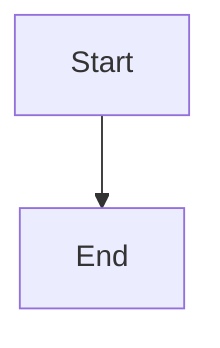

# Tóm tắt các cải tiến đã thực hiện

## ✅ Đã hoàn thành

### A. Tích hợp thanh tìm kiếm (Search Bar) 🔍

- **Giải pháp**: Algolia DocSearch (đã được cấu hình sẵn trong config)
- **Tính năng**:
  - Tìm kiếm mạnh mẽ với Algolia
  - Hỗ trợ tìm kiếm theo ngữ cảnh
  - Thanh tìm kiếm đã được thêm vào navbar (góc phải trên)
  - **Cần đăng ký**: Xem file `SEARCH-SETUP.md` để biết cách cấu hình

### B. Vẽ sơ đồ kiến trúc (Mermaid JS) 📊

- **Theme**: `@docusaurus/theme-mermaid`
- **Tính năng**:
  - Vẽ sơ đồ trực tiếp trong Markdown
  - Hỗ trợ nhiều loại sơ đồ: Flowchart, Sequence, Network, Gantt, Class Diagram, State Diagram
  - File ví dụ: `docs/mermaid-examples.md`

**Cách sử dụng:**
```markdown

```

### C. Tự động Deploy (CI/CD) 🚀

- **File**: `.gitlab-ci.yml`
- **Tính năng**:
  - Tự động build khi có commit mới
  - Hỗ trợ deploy qua SSH/RSYNC
  - Hỗ trợ deploy lên GitLab Pages
  - Cache node_modules để tăng tốc build
  - File hướng dẫn: `CI-CD-SETUP.md`

## 📦 Cài đặt dependencies

Chạy lệnh sau để cài đặt các package mới:

```bash
npm install
```

**Lưu ý**: Package Mermaid đã được thêm vào. Search sẽ sử dụng Algolia DocSearch (miễn phí).

## 🚀 Các bước tiếp theo

### 1. Cấu hình và test tính năng Search

1. Đọc file `SEARCH-SETUP.md` để biết cách đăng ký Algolia DocSearch
2. Sau khi có thông tin từ Algolia, cập nhật `docusaurus.config.js`
3. Build và test:
```bash
npm run build
npm run serve
```

Mở trình duyệt và kiểm tra thanh tìm kiếm ở góc phải trên navbar.

### 2. Test tính năng Mermaid

Xem file `docs/mermaid-examples.md` để xem các ví dụ về sơ đồ Mermaid.

### 3. Cấu hình CI/CD

1. Đọc file `CI-CD-SETUP.md` để biết cách cấu hình
2. Thêm các biến môi trường trong GitLab (Settings > CI/CD > Variables)
3. Commit và push code lên GitLab để test pipeline

## 📝 Files đã thay đổi/tạo mới

### Đã cập nhật:
- `package.json` - Thêm dependencies mới
- `docusaurus.config.js` - Thêm search plugin, Mermaid theme, và cập nhật title

### Đã tạo mới:
- `.gitlab-ci.yml` - File cấu hình CI/CD
- `CI-CD-SETUP.md` - Hướng dẫn cấu hình CI/CD
- `SEARCH-SETUP.md` - Hướng dẫn cấu hình tìm kiếm Algolia
- `docs/mermaid-examples.md` - Ví dụ sử dụng Mermaid
- `UPGRADE-SUMMARY.md` - File này

## 🎯 Kết quả

Sau khi hoàn thành các bước trên, bạn sẽ có:
- ✅ Thanh tìm kiếm hoạt động trong trang docs
- ✅ Khả năng vẽ sơ đồ kiến trúc bằng Mermaid
- ✅ CI/CD tự động build và deploy khi push code lên GitLab

## 💡 Lưu ý

- Đảm bảo chạy `npm install` trước khi build
- **Search**: Cần đăng ký Algolia DocSearch và cấu hình trong `docusaurus.config.js` (xem `SEARCH-SETUP.md`)
- Mermaid sẽ tự động render khi build hoặc chạy dev server
- CI/CD cần cấu hình các biến môi trường trong GitLab trước khi sử dụng (xem `CI-CD-SETUP.md`)

