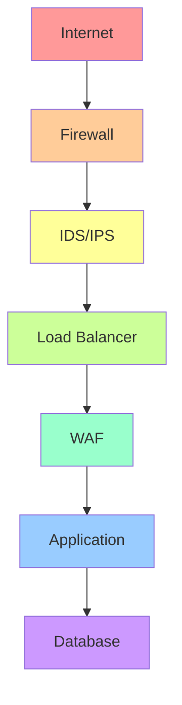

import Author from '@site/src/components/Author';
import Feedback from '@site/src/components/Feedback';

<Author 
  name="Security Team"
  email="security@osstech.com"
  role="Security Engineer"
  lastUpdated="2024-12-25"
/>

# Network Security - Bảo mật mạng

:::info Tổng quan
Network Security là tập hợp các chính sách, thực hành và công nghệ được thiết kế để bảo vệ tính toàn vẹn, bảo mật và khả năng truy cập của mạng và dữ liệu.
:::

## 1. Khái niệm cơ bản

### 1.1. Mô hình OSI và Security

**OSI Model Layers và Security Concerns**:

| Layer | Name | Security Focus |
|-------|------|---------------|
| 7 | Application | Authentication, Authorization |
| 6 | Presentation | Encryption, Data format |
| 5 | Session | Session management |
| 4 | Transport | TLS/SSL, Firewall rules |
| 3 | Network | IPsec, Routing security |
| 2 | Data Link | MAC filtering, VLAN |
| 1 | Physical | Physical access control |

### 1.2. Defense in Depth

**Nguyên tắc**: Nhiều lớp bảo vệ



## 2. Firewall và Network Segmentation

### 2.1. Firewall Types

**Packet Filtering Firewall**:
- Lọc dựa trên IP, port, protocol
- Layer 3 và 4
- Fast nhưng limited

**Stateful Firewall**:
- Track connection state
- More intelligent
- Better security

**Application Firewall (WAF)**:
- Layer 7 inspection
- Understand application protocols
- Protect against application attacks

### 2.2. Network Segmentation

**VLANs (Virtual LANs)**:
```bash title="Terminal - VLAN Configuration"
# Create VLAN
vconfig add eth0 100

# Configure VLAN
ifconfig eth0.100 up
ip addr add 192.168.100.1/24 dev eth0.100
```

**Subnetting**:
- Isolate network segments
- Reduce attack surface
- Compliance requirements

## 3. VPN và Encryption

### 3.1. VPN Types

**Site-to-Site VPN**:
- Connect offices
- Always-on connection
- IPsec or SSL

**Remote Access VPN**:
- Connect remote users
- On-demand
- SSL VPN common

### 3.2. IPsec

**Components**:
- **AH (Authentication Header)**: Authentication
- **ESP (Encapsulating Security Payload)**: Encryption + Authentication
- **IKE (Internet Key Exchange)**: Key management

**Modes**:
- **Transport Mode**: End-to-end encryption
- **Tunnel Mode**: Gateway-to-gateway

## 4. IDS/IPS

### 4.1. IDS (Intrusion Detection System)

**Types**:
- **Network-based (NIDS)**: Monitor network traffic
- **Host-based (HIDS)**: Monitor individual hosts

**Detection Methods**:
- **Signature-based**: Known attack patterns
- **Anomaly-based**: Behavioral analysis
- **Heuristic**: Rule-based

### 4.2. IPS (Intrusion Prevention System)

**Difference from IDS**:
- IDS: Detect and alert
- IPS: Detect and prevent

**Actions**:
- Block traffic
- Reset connections
- Rate limiting

## 5. DDoS Protection

### 5.1. DDoS Attack Types

**Volume-based**:
- UDP floods
- ICMP floods
- Amplification attacks

**Protocol-based**:
- SYN floods
- Ping of Death
- Smurf attacks

**Application-layer**:
- HTTP floods
- Slowloris
- Zero-day attacks

### 5.2. Mitigation Strategies

**Rate Limiting**:
```nginx title="nginx.conf - Rate Limiting"
limit_req_zone $binary_remote_addr zone=api_limit:10m rate=10r/s;

server {
    location /api/ {
        limit_req zone=api_limit burst=20 nodelay;
    }
}
```

**CDN Protection**:
- Distribute traffic
- Absorb attacks
- Geographic distribution

**Cloud-based Protection**:
- AWS Shield
- Cloudflare
- Akamai

## 6. Network Monitoring

### 6.1. Packet Capture

**tcpdump**:
```bash title="Terminal - tcpdump Examples"
# Capture all traffic
tcpdump -i eth0

# Capture specific port
tcpdump -i eth0 port 80

# Save to file
tcpdump -i eth0 -w capture.pcap

# Read from file
tcpdump -r capture.pcap
```

**Wireshark**:
- GUI packet analyzer
- Deep packet inspection
- Protocol analysis

### 6.2. Network Flow Analysis

**NetFlow / sFlow**:
- Traffic statistics
- Bandwidth monitoring
- Anomaly detection

## 7. Best Practices

### 7.1. Network Hardening

- Disable unused services
- Close unused ports
- Use strong encryption
- Regular updates
- Network segmentation

### 7.2. Access Control

- Least privilege
- Network ACLs
- VPN for remote access
- Multi-factor authentication

### 7.3. Monitoring

- Real-time monitoring
- Log analysis
- Alerting
- Incident response plan

## 8. Tài liệu tham khảo

- [NIST Network Security Guide](https://csrc.nist.gov/publications)
- [OWASP Network Security](https://owasp.org/)
- [CIS Network Security Benchmarks](https://www.cisecurity.org/)

---

<Feedback />

