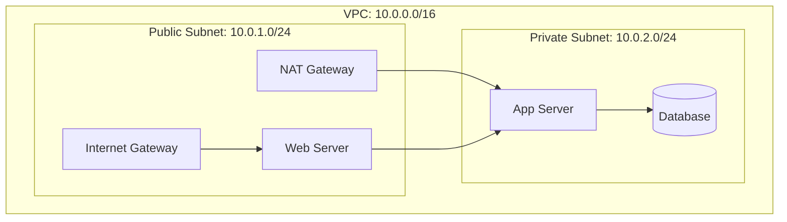

import Author from '@site/src/components/Author';
import Feedback from '@site/src/components/Feedback';

<Author 
  name="Cloud Team"
  email="cloud@osstech.com"
  role="AWS Solutions Architect"
  lastUpdated="2024-12-25"
/>

# AWS Services - Tổng quan các dịch vụ

:::info Tổng quan
Amazon Web Services (AWS) cung cấp hơn 200 dịch vụ cloud, từ compute, storage đến AI/ML. Tài liệu này giới thiệu các dịch vụ quan trọng nhất.
:::

## 1. Compute Services

### 1.1. EC2 (Elastic Compute Cloud)

**Định nghĩa**: Virtual servers trong cloud

**Instance Types**:
- **General Purpose**: t3, t4g, m5, m6i
- **Compute Optimized**: c5, c6i (CPU-intensive)
- **Memory Optimized**: r5, r6i (Memory-intensive)
- **Storage Optimized**: i3, i4i (High IOPS)
- **GPU Instances**: p3, p4 (Machine Learning)

**Pricing Models**:
- **On-Demand**: Pay per hour
- **Reserved**: 1-3 year commitment (up to 75% discount)
- **Spot**: Bid for unused capacity (up to 90% discount)
- **Savings Plans**: Flexible pricing model

**Example**:

```bash title="Terminal - Launch EC2 instance"
aws ec2 run-instances \
  --image-id ami-0c55b159cbfafe1f0 \
  --instance-type t3.micro \
  --key-name my-key-pair \
  --security-group-ids sg-12345678 \
  --subnet-id subnet-12345678 \
  --tag-specifications 'ResourceType=instance,Tags=[{Key=Name,Value=WebServer}]'
```

### 1.2. Lambda (Serverless Computing)

**Định nghĩa**: Run code without provisioning servers

**Use Cases**:
- Event-driven applications
- API backends
- Data processing
- Scheduled tasks

**Limits**:
- Memory: 128 MB - 10 GB
- Timeout: 15 minutes
- Package size: 50 MB (zipped), 250 MB (unzipped)

**Example**:

```python title="lambda_function.py"
import json

def lambda_handler(event, context):
    # Process event
    name = event.get('name', 'World')
    
    return {
        'statusCode': 200,
        'body': json.dumps(f'Hello, {name}!')
    }
```

### 1.3. ECS (Elastic Container Service)

**Định nghĩa**: Container orchestration service

**Launch Types**:
- **EC2**: Manage your own EC2 instances
- **Fargate**: Serverless containers

**Components**:
- **Cluster**: Group of container instances
- **Task Definition**: Blueprint for containers
- **Service**: Maintains desired number of tasks
- **Task**: Running container instance

### 1.4. EKS (Elastic Kubernetes Service)

**Định nghĩa**: Managed Kubernetes service

**Features**:
- Fully managed control plane
- Compatible with Kubernetes
- Integration with AWS services
- Auto-scaling

## 2. Storage Services

### 2.1. S3 (Simple Storage Service)

**Định nghĩa**: Object storage service

**Storage Classes**:
- **Standard**: Frequently accessed data
- **Standard-IA**: Infrequently accessed (cheaper)
- **Glacier**: Archive storage (cheapest)
- **Glacier Deep Archive**: Long-term archive

**Features**:
- 99.999999999% (11 9's) durability
- Versioning
- Lifecycle policies
- Encryption

**Example**:

```bash title="Terminal - S3 Operations"
# Create bucket
aws s3 mb s3://my-bucket-name

# Upload file
aws s3 cp file.txt s3://my-bucket-name/

# Download file
aws s3 cp s3://my-bucket-name/file.txt ./

# Sync directory
aws s3 sync ./local-folder s3://my-bucket-name/folder/
```

### 2.2. EBS (Elastic Block Store)

**Định nghĩa**: Block storage for EC2 instances

**Volume Types**:
- **gp3**: General Purpose SSD (latest)
- **gp2**: General Purpose SSD
- **io1/io2**: Provisioned IOPS SSD
- **st1**: Throughput Optimized HDD
- **sc1**: Cold HDD

**Features**:
- Persistent storage
- Snapshots
- Encryption
- Multi-attach (io1/io2)

### 2.3. EFS (Elastic File System)

**Định nghĩa**: Managed NFS file system

**Use Cases**:
- Shared storage for multiple EC2 instances
- Content management
- Web serving
- Big data analytics

## 3. Database Services

### 3.1. RDS (Relational Database Service)

**Supported Engines**:
- MySQL
- PostgreSQL
- MariaDB
- Oracle
- SQL Server
- Aurora (MySQL/PostgreSQL compatible)

**Features**:
- Automated backups
- Multi-AZ deployment
- Read replicas
- Automated patching

### 3.2. DynamoDB (NoSQL Database)

**Định nghĩa**: Fully managed NoSQL database

**Features**:
- Single-digit millisecond latency
- Auto-scaling
- Built-in security
- Global tables

**Data Model**:
- Tables
- Items (rows)
- Attributes (columns)
- Primary Key (Partition Key + Sort Key)

**Example**:

```python title="DynamoDB Operations"
import boto3

dynamodb = boto3.resource('dynamodb')
table = dynamodb.Table('Users')

# Put item
table.put_item(
    Item={
        'UserId': '123',
        'Name': 'John Doe',
        'Email': 'john@example.com'
    }
)

# Get item
response = table.get_item(
    Key={'UserId': '123'}
)
```

### 3.3. Redshift (Data Warehouse)

**Định nghĩa**: Petabyte-scale data warehouse

**Use Cases**:
- Business intelligence
- Data analytics
- Data warehousing

## 4. Networking Services

### 4.1. VPC (Virtual Private Cloud)

**Định nghĩa**: Isolated network environment

**Components**:
- **Subnets**: Network segments
- **Route Tables**: Routing rules
- **Internet Gateway**: Internet access
- **NAT Gateway**: Outbound internet for private subnets
- **Security Groups**: Firewall rules
- **Network ACLs**: Additional security layer

**Example VPC Architecture**:



### 4.2. CloudFront (CDN)

**Định nghĩa**: Content delivery network

**Features**:
- Global edge locations
- DDoS protection
- SSL/TLS certificates
- Custom origins

### 4.3. Route 53 (DNS Service)

**Định nghĩa**: Scalable DNS and domain registration

**Record Types**:
- A, AAAA: IPv4/IPv6 addresses
- CNAME: Canonical name
- MX: Mail exchange
- TXT: Text records

## 5. Security Services

### 5.1. IAM (Identity and Access Management)

**Components**:
- **Users**: Individual accounts
- **Groups**: Collections of users
- **Roles**: Temporary credentials
- **Policies**: Permissions

**Best Practices**:
- Least privilege
- MFA for root account
- Use roles instead of users when possible
- Regular access reviews

### 5.2. KMS (Key Management Service)

**Định nghĩa**: Managed encryption keys

**Features**:
- Create and manage keys
- Encryption/decryption APIs
- Integration with other AWS services
- Audit key usage

### 5.3. Secrets Manager

**Định nghĩa**: Store and rotate secrets

**Features**:
- Automatic rotation
- Integration with RDS, Redshift
- Encryption at rest
- Fine-grained access control

## 6. Monitoring and Logging

### 6.1. CloudWatch

**Services**:
- **Metrics**: System and application metrics
- **Logs**: Centralized logging
- **Alarms**: Automated actions
- **Dashboards**: Visualization

**Example**:

```python title="CloudWatch Metrics"
import boto3

cloudwatch = boto3.client('cloudwatch')

# Put custom metric
cloudwatch.put_metric_data(
    Namespace='MyApp',
    MetricData=[
        {
            'MetricName': 'RequestCount',
            'Value': 100,
            'Unit': 'Count'
        }
    ]
)
```

### 6.2. CloudTrail

**Định nghĩa**: API logging and auditing

**Features**:
- Log all API calls
- Track who did what, when
- Compliance auditing
- Security analysis

## 7. Best Practices

### 7.1. Cost Optimization

- Use Reserved Instances for predictable workloads
- Right-size instances
- Use Spot Instances for flexible workloads
- Enable S3 lifecycle policies
- Monitor with Cost Explorer

### 7.2. Security

- Enable MFA
- Use IAM roles
- Encrypt data at rest and in transit
- Enable CloudTrail
- Regular security audits

### 7.3. Reliability

- Multi-AZ deployment
- Automated backups
- Health checks
- Auto-scaling
- Disaster recovery plan

## 8. Tài liệu tham khảo

- [AWS Documentation](https://docs.aws.amazon.com/)
- [AWS Well-Architected Framework](https://aws.amazon.com/architecture/well-architected/)
- [AWS Service Health Dashboard](https://status.aws.amazon.com/)

---

<Feedback />

