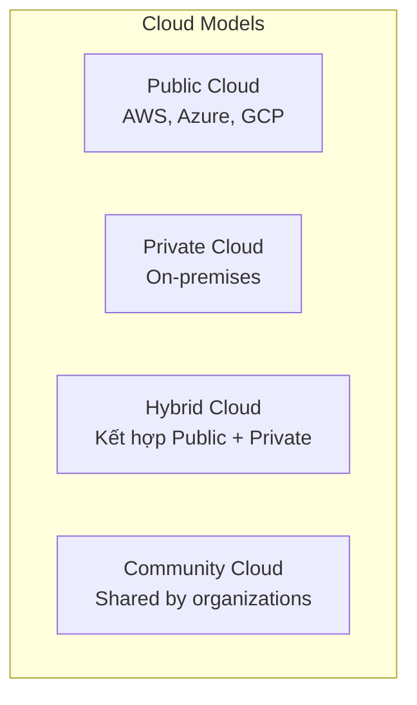
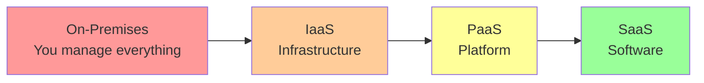
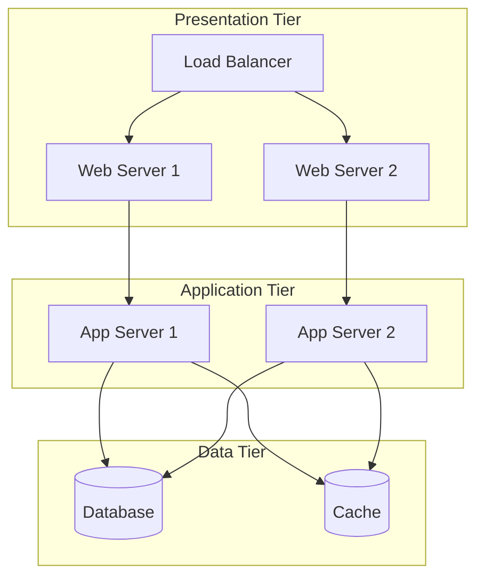
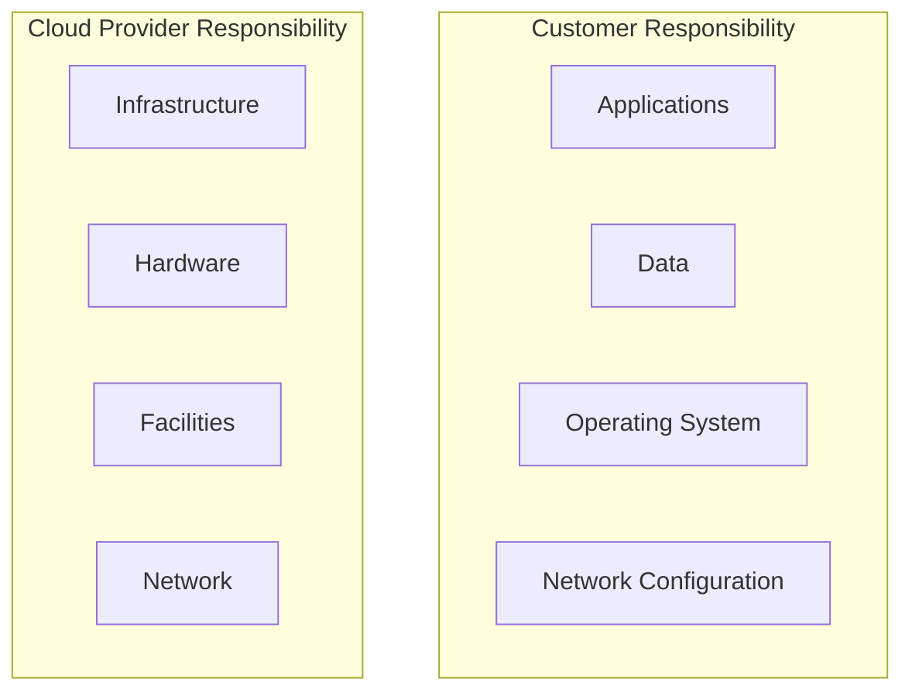
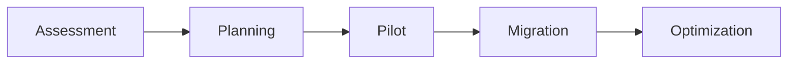

import Author from '@site/src/components/Author';
import Feedback from '@site/src/components/Feedback';

<Author 
  name="Cloud Team"
  email="cloud@osstech.com"
  role="Cloud Architect"
  lastUpdated="2024-12-25"
/>

# Cloud Computing Fundamentals

:::info Định nghĩa
Cloud Computing là mô hình cung cấp dịch vụ công nghệ thông tin qua Internet, cho phép truy cập tài nguyên tính toán (servers, storage, databases, networking) theo nhu cầu.
:::

## 1. Khái niệm cơ bản

### 1.1. Định nghĩa Cloud Computing

**NIST Definition** (National Institute of Standards and Technology):

Cloud computing là mô hình cho phép truy cập mạng thuận tiện, theo nhu cầu tới một nhóm tài nguyên tính toán có thể chia sẻ (ví dụ: networks, servers, storage, applications, services) có thể được cung cấp và giải phóng nhanh chóng với nỗ lực quản lý tối thiểu hoặc tương tác với nhà cung cấp dịch vụ.

### 1.2. Đặc điểm cơ bản (5 Essential Characteristics)

1. **On-demand self-service**: Người dùng có thể tự cung cấp tài nguyên
2. **Broad network access**: Truy cập qua mạng từ bất kỳ đâu
3. **Resource pooling**: Tài nguyên được chia sẻ giữa nhiều khách hàng
4. **Rapid elasticity**: Tự động scale up/down
5. **Measured service**: Thanh toán theo sử dụng thực tế

### 1.3. Mô hình triển khai (Deployment Models)

**Public Cloud**:
- Cung cấp bởi third-party provider
- Multi-tenant
- Pay-as-you-go
- Ví dụ: AWS, Azure, GCP

**Private Cloud**:
- Dành riêng cho một organization
- On-premises hoặc hosted
- More control, higher cost
- Ví dụ: OpenStack, VMware

**Hybrid Cloud**:
- Kết hợp public và private
- Flexibility và control
- Data sovereignty

**Community Cloud**:
- Chia sẻ giữa các organizations
- Common concerns (security, compliance)

### 1.4. Mô hình dịch vụ (Service Models)

**IaaS (Infrastructure as a Service)**:
- Cung cấp: Virtual machines, storage, networking
- Quản lý: OS, middleware, applications
- Ví dụ: AWS EC2, Azure VMs, GCP Compute Engine

**PaaS (Platform as a Service)**:
- Cung cấp: Runtime environment, development tools
- Quản lý: Applications, data
- Ví dụ: Heroku, AWS Elastic Beanstalk, Azure App Service

**SaaS (Software as a Service)**:
- Cung cấp: Complete applications
- Quản lý: Nothing (chỉ sử dụng)
- Ví dụ: Gmail, Salesforce, Office 365

## 2. Lợi ích và thách thức

### 2.1. Lợi ích

**Cost Efficiency**:
- Giảm capital expenditure (CapEx)
- Pay-as-you-go model
- Không cần đầu tư hardware

**Scalability**:
- Auto-scaling
- Handle traffic spikes
- Global reach

**Flexibility**:
- Rapid provisioning
- Easy to experiment
- Multiple deployment options

**Reliability**:
- High availability
- Disaster recovery
- Redundancy

### 2.2. Thách thức

**Security Concerns**:
- Data privacy
- Compliance
- Shared responsibility model

**Vendor Lock-in**:
- Khó chuyển đổi provider
- Proprietary services
- Migration costs

**Cost Management**:
- Unexpected costs
- Resource waste
- Complex pricing

**Network Dependency**:
- Requires internet
- Latency issues
- Bandwidth costs

## 3. Các nhà cung cấp Cloud lớn

### 3.1. AWS (Amazon Web Services)

**Market Share**: ~32% (2024)

**Strengths**:
- Largest service portfolio
- Mature ecosystem
- Global infrastructure
- Extensive documentation

**Key Services**:
- Compute: EC2, Lambda, ECS
- Storage: S3, EBS, Glacier
- Database: RDS, DynamoDB, Redshift
- Networking: VPC, CloudFront, Route 53

### 3.2. Microsoft Azure

**Market Share**: ~23% (2024)

**Strengths**:
- Enterprise integration
- Hybrid cloud support
- .NET ecosystem
- Office 365 integration

**Key Services**:
- Compute: Virtual Machines, App Service, Functions
- Storage: Blob Storage, Files, Disk
- Database: SQL Database, Cosmos DB
- AI/ML: Cognitive Services, Machine Learning

### 3.3. Google Cloud Platform (GCP)

**Market Share**: ~10% (2024)

**Strengths**:
- Data analytics
- Machine Learning
- Kubernetes (GKE)
- Competitive pricing

**Key Services**:
- Compute: Compute Engine, App Engine, Cloud Functions
- Storage: Cloud Storage, Persistent Disk
- Database: Cloud SQL, Firestore, BigQuery
- AI/ML: AI Platform, Vision API, Speech API

## 4. Cloud Architecture Patterns

### 4.1. Multi-Tier Architecture

### 4.2. Microservices Architecture

**Đặc điểm**:
- Loosely coupled services
- Independent deployment
- Technology diversity
- Fault isolation

**Benefits**:
- Scalability
- Flexibility
- Faster development
- Team autonomy

**Challenges**:
- Complexity
- Network latency
- Data consistency
- Testing

### 4.3. Serverless Architecture

**Concept**:
- No server management
- Event-driven
- Auto-scaling
- Pay per execution

**Use Cases**:
- API backends
- Event processing
- Scheduled tasks
- Real-time data processing

## 5. Cloud Security

### 5.1. Shared Responsibility Model

### 5.2. Security Best Practices

**Identity and Access Management (IAM)**:
- Least privilege principle
- Multi-factor authentication
- Regular access reviews
- Role-based access control

**Data Protection**:
- Encryption at rest
- Encryption in transit
- Key management
- Data classification

**Network Security**:
- VPC configuration
- Security groups
- Network ACLs
- DDoS protection

**Monitoring and Logging**:
- CloudTrail / Activity logs
- CloudWatch / Monitoring
- Security alerts
- Incident response

## 6. Cost Optimization

### 6.1. Strategies

**Right-sizing**:
- Analyze resource utilization
- Choose appropriate instance types
- Use auto-scaling

**Reserved Instances**:
- 1-3 year commitments
- Significant discounts (up to 75%)
- Predictable workloads

**Spot Instances**:
- Up to 90% discount
- Interruptible workloads
- Batch processing

**Storage Optimization**:
- Lifecycle policies
- Compression
- Archive unused data

### 6.2. Cost Monitoring

**Tools**:
- AWS Cost Explorer
- Azure Cost Management
- GCP Billing Reports

**Best Practices**:
- Set up budgets and alerts
- Tag resources
- Regular cost reviews
- Use cost allocation tags

## 7. Migration Strategies

### 7.1. The 6 R's

1. **Rehost (Lift and Shift)**: Move as-is
2. **Replatform (Lift and Reshape)**: Minor optimizations
3. **Repurchase (Drop and Shop)**: Switch to SaaS
4. **Refactor (Re-architect)**: Rebuild for cloud
5. **Retire**: Decommission unused
6. **Retain**: Keep on-premises

### 7.2. Migration Phases

## 8. Tài liệu tham khảo

- [AWS Well-Architected Framework](https://aws.amazon.com/architecture/well-architected/)
- [Azure Architecture Center](https://docs.microsoft.com/azure/architecture/)
- [GCP Architecture Center](https://cloud.google.com/architecture)
- [NIST Cloud Computing](https://www.nist.gov/publications/nist-definition-cloud-computing)

---

<Feedback />

