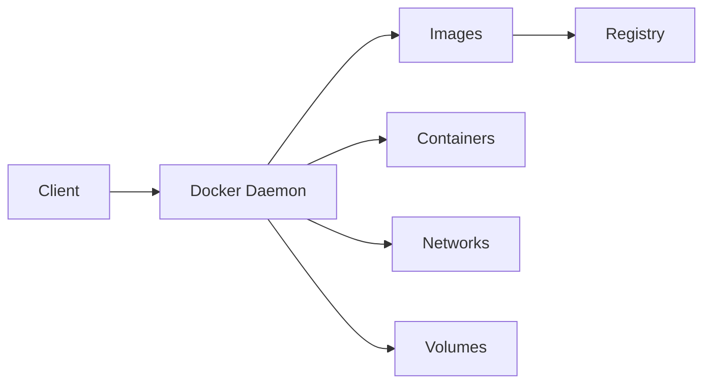
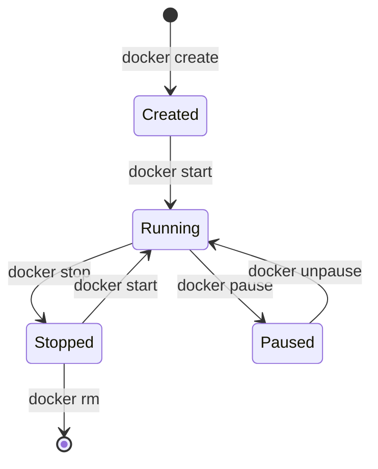

import Author from '@site/src/components/Author';
import Feedback from '@site/src/components/Feedback';

<Author 
  name="DevOps Team"
  email="devops@osstech.com"
  role="DevOps Engineer"
  lastUpdated="2024-12-25"
/>

# Docker Fundamentals - Nguyên lý cơ bản

:::info Định nghĩa
Docker là nền tảng containerization cho phép đóng gói ứng dụng và dependencies vào một container nhẹ, portable, có thể chạy nhất quán trên mọi môi trường.
:::

## 1. Khái niệm cơ bản

### 1.1. Container vs Virtual Machine

```mermaid
graph TB
    subgraph "Virtual Machine"
        VM1[App 1] --> OS1[Guest OS]
        VM2[App 2] --> OS2[Guest OS]
        OS1 --> Hypervisor
        OS2 --> Hypervisor
        Hypervisor --> Host OS
        Host OS --> Hardware
    end
    
    subgraph "Container"
        C1[App 1] --> Docker Engine
        C2[App 2] --> Docker Engine
        Docker Engine --> Host OS
        Host OS --> Hardware
    end
```

**So sánh**:

| Aspect | Virtual Machine | Container |
|--------|----------------|-----------|
| Isolation | Full OS isolation | Process isolation |
| Size | GBs | MBs |
| Startup | Minutes | Seconds |
| Resource | Heavy | Light |
| Portability | Limited | High |

### 1.2. Docker Architecture

**Components**:
- **Docker Engine**: Runtime và build tool
- **Docker Image**: Template for containers
- **Docker Container**: Running instance
- **Docker Registry**: Store images (Docker Hub)

**Architecture**:



## 2. Docker Images

### 2.1. Image Layers

**Concept**: Images are built from layers

```dockerfile title="Dockerfile Example"
FROM node:20-alpine          # Layer 1: Base image
WORKDIR /app                # Layer 2: Working directory
COPY package*.json ./       # Layer 3: Dependencies
RUN npm ci                  # Layer 4: Install
COPY . .                    # Layer 5: Application code
EXPOSE 3000                 # Layer 6: Port
CMD ["npm", "start"]        # Layer 7: Command
```

**Layer Benefits**:
- Reusability
- Caching
- Smaller images
- Faster builds

### 2.2. Dockerfile Best Practices

**Multi-stage Builds**:
```dockerfile title="Multi-stage Dockerfile"
# Build stage
FROM node:20 AS builder
WORKDIR /app
COPY package*.json ./
RUN npm ci
COPY . .
RUN npm run build

# Production stage
FROM node:20-alpine
WORKDIR /app
COPY --from=builder /app/dist ./dist
COPY --from=builder /app/node_modules ./node_modules
COPY package*.json ./
EXPOSE 3000
CMD ["npm", "start"]
```

**Optimization Tips**:
- Use .dockerignore
- Order commands by change frequency
- Use specific tags (not `latest`)
- Minimize layers
- Use alpine images when possible

## 3. Docker Containers

### 3.1. Container Lifecycle



### 3.2. Common Commands

```bash title="Terminal - Docker Commands"
# Build image
docker build -t myapp:latest .

# Run container
docker run -d -p 3000:3000 --name myapp myapp:latest

# List containers
docker ps
docker ps -a

# View logs
docker logs myapp
docker logs -f myapp

# Execute command in container
docker exec -it myapp sh

# Stop container
docker stop myapp

# Remove container
docker rm myapp

# Remove image
docker rmi myapp:latest
```

## 4. Docker Networking

### 4.1. Network Types

**Bridge Network** (Default):
- Isolated network
- Containers can communicate
- Port mapping to host

**Host Network**:
- Use host's network directly
- No isolation
- Better performance

**None Network**:
- No networking
- Complete isolation

**Custom Networks**:
```bash title="Terminal - Custom Network"
# Create network
docker network create mynetwork

# Run container in network
docker run -d --network mynetwork --name app1 myapp:latest
docker run -d --network mynetwork --name app2 myapp:latest

# Containers can communicate by name
# app1 can reach app2 by hostname "app2"
```

### 4.2. Port Mapping

```bash title="Terminal - Port Mapping"
# Map host port to container port
docker run -p 8080:3000 myapp:latest

# Map all ports
docker run -P myapp:latest

# Specific IP
docker run -p 127.0.0.1:8080:3000 myapp:latest
```

## 5. Docker Volumes

### 5.1. Volume Types

**Named Volumes**:
```bash title="Terminal - Named Volumes"
# Create volume
docker volume create mydata

# Use volume
docker run -v mydata:/data myapp:latest
```

**Bind Mounts**:
```bash title="Terminal - Bind Mounts"
# Mount host directory
docker run -v /host/path:/container/path myapp:latest
```

**tmpfs Mounts**:
```bash title="Terminal - tmpfs"
# In-memory storage
docker run --tmpfs /tmp myapp:latest
```

### 5.2. Volume Best Practices

- Use named volumes for data persistence
- Use bind mounts for development
- Backup volumes regularly
- Consider volume drivers for cloud storage

## 6. Docker Compose

### 6.1. Compose File

```yaml title="docker-compose.yml"
version: '3.8'

services:
  web:
    build: .
    ports:
      - "3000:3000"
    environment:
      - NODE_ENV=production
    depends_on:
      - db
    networks:
      - app-network

  db:
    image: postgres:15-alpine
    environment:
      - POSTGRES_DB=mydb
      - POSTGRES_USER=user
      - POSTGRES_PASSWORD=password
    volumes:
      - db-data:/var/lib/postgresql/data
    networks:
      - app-network

volumes:
  db-data:

networks:
  app-network:
    driver: bridge
```

### 6.2. Compose Commands

```bash title="Terminal - Docker Compose"
# Start services
docker-compose up -d

# Stop services
docker-compose down

# View logs
docker-compose logs -f

# Scale services
docker-compose up -d --scale web=3

# Build and start
docker-compose up --build
```

## 7. Docker Security

### 7.1. Best Practices

**Run as non-root**:
```dockerfile title="Dockerfile - Non-root User"
FROM node:20-alpine
RUN addgroup -g 1001 -S nodejs && \
    adduser -S nodejs -u 1001
USER nodejs
WORKDIR /app
```

**Scan images**:
```bash title="Terminal - Image Scanning"
# Use Docker Scout or Trivy
docker scout cves myapp:latest
```

**Limit resources**:
```bash title="Terminal - Resource Limits"
docker run --memory="512m" --cpus="1.0" myapp:latest
```

**Use secrets**:
```bash title="Terminal - Docker Secrets"
echo "mysecret" | docker secret create db_password -
```

### 7.2. Security Considerations

- Don't run as root
- Use minimal base images
- Scan for vulnerabilities
- Keep images updated
- Use multi-stage builds
- Don't store secrets in images

## 8. Tài liệu tham khảo

- [Docker Documentation](https://docs.docker.com/)
- [Docker Best Practices](https://docs.docker.com/develop/dev-best-practices/)
- [OWASP Docker Security](https://owasp.org/www-project-docker-top-10/)

---

<Feedback />

