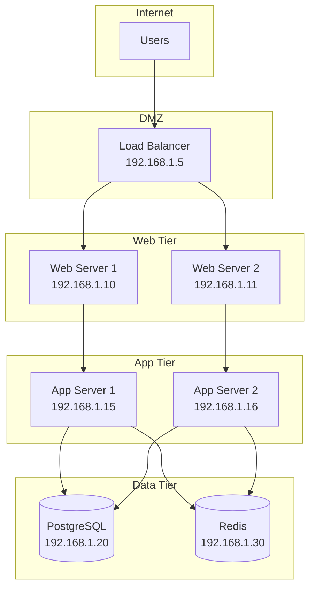
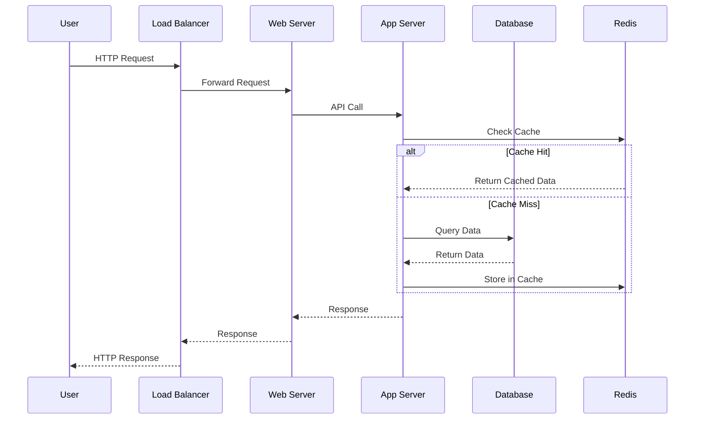
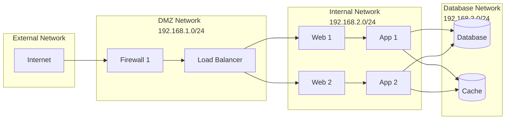

import Author from '@site/src/components/Author';
import Feedback from '@site/src/components/Feedback';

<Author 
  name="DevOps Team"
  email="devops@osstech.com"
  role="DevOps"
  lastUpdated="2024-12-25"
/>

# Sơ đồ hệ thống

:::info Tổng quan
Sơ đồ kiến trúc hệ thống của Osstech, bao gồm các server, network, và luồng dữ liệu.
:::

## Sơ đồ kiến trúc tổng thể

## Luồng dữ liệu

## Network Topology

## Ports và Services

| Server | Service | Port | Protocol |
|--------|---------|------|----------|
| Load Balancer | HTTP | 80 | TCP |
| Load Balancer | HTTPS | 443 | TCP |
| Web Server | Nginx | 80, 443 | TCP |
| App Server | Node.js | 3000 | TCP |
| Database | PostgreSQL | 5432 | TCP |
| Cache | Redis | 6379 | TCP |

---

<Feedback />

