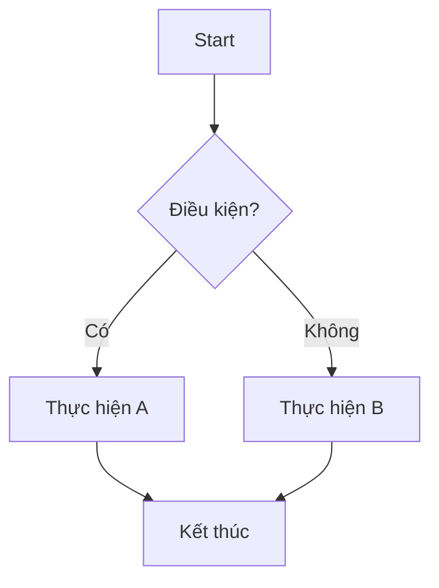
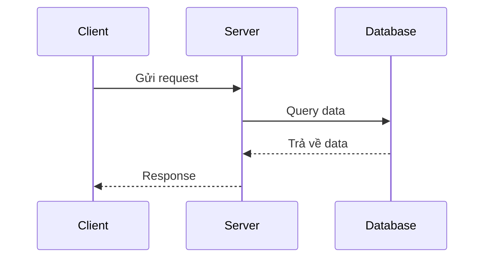
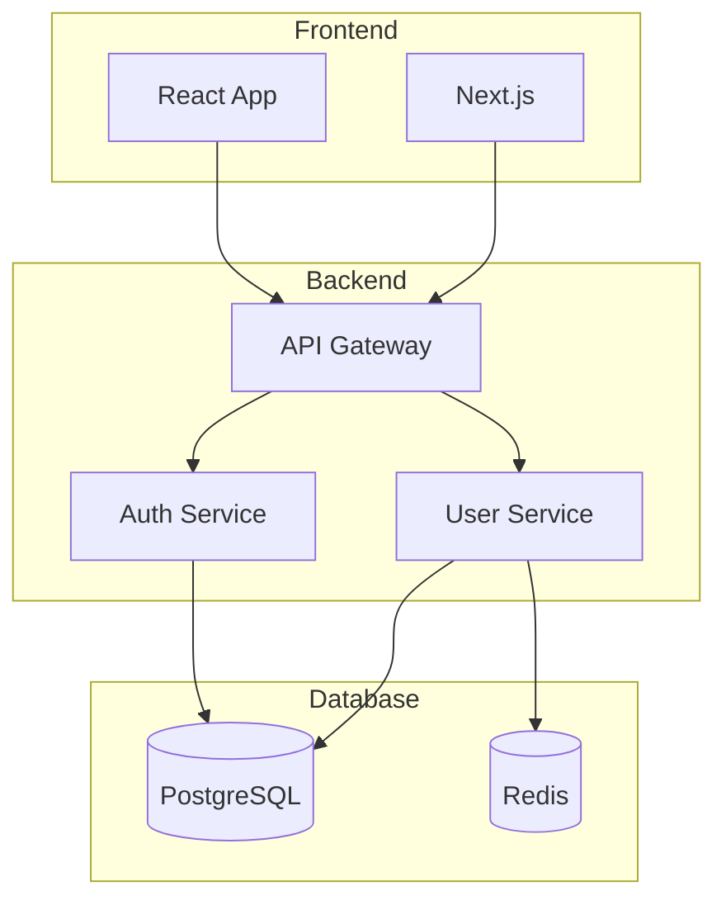
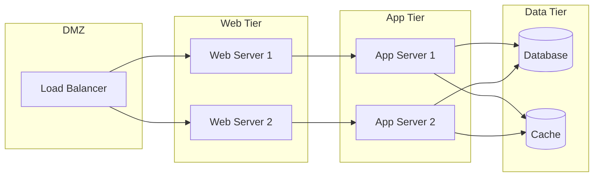
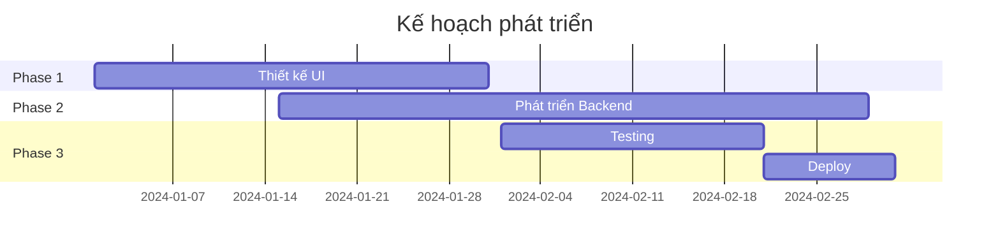
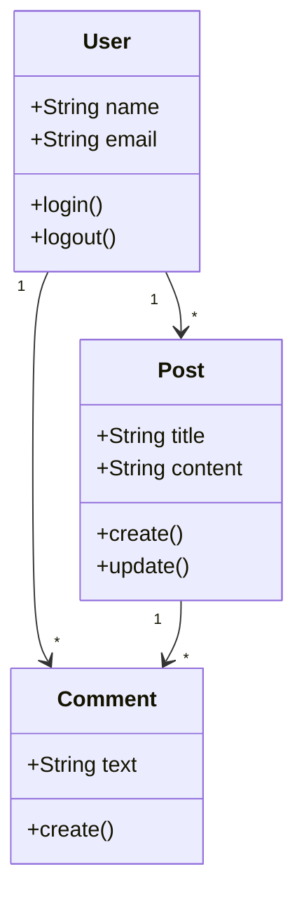
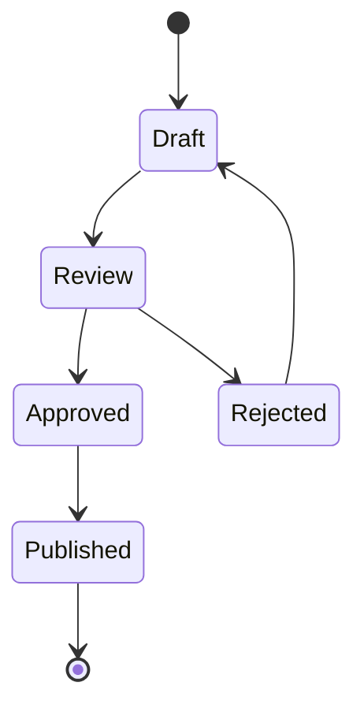

# Ví dụ sử dụng Mermaid

Docusaurus hỗ trợ vẽ sơ đồ bằng Mermaid. Bạn có thể sử dụng các loại sơ đồ sau:

## Sơ đồ Flowchart (Lưu đồ)

## Sơ đồ Sequence (Trình tự)

## Sơ đồ kiến trúc hệ thống

## Sơ đồ Network/Infrastructure

## Sơ đồ Gantt (Tiến độ dự án)

## Sơ đồ Class Diagram

## Sơ đồ State Diagram

## Lưu ý

- Tất cả các sơ đồ Mermaid sẽ tự động render khi bạn build hoặc chạy dev server
- Bạn có thể sử dụng bất kỳ loại sơ đồ nào mà Mermaid hỗ trợ
- Tham khảo thêm tại: https://mermaid.js.org/

