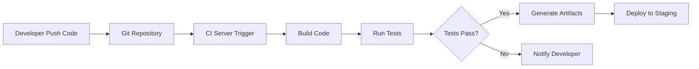
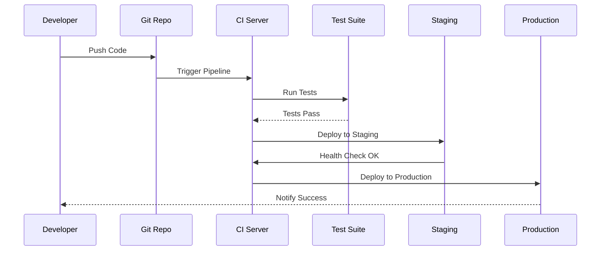

import Author from '@site/src/components/Author';
import Feedback from '@site/src/components/Feedback';
import Tabs from '@theme/Tabs';
import TabItem from '@theme/TabItem';

<Author 
  name="DevOps Team"
  email="devops@osstech.com"
  role="DevOps Engineer"
  lastUpdated="2024-12-25"
/>

# CI/CD Fundamentals - Nguyên lý cơ bản

:::info Tổng quan
Continuous Integration (CI) và Continuous Deployment (CD) là các phương pháp tự động hóa quy trình phát triển phần mềm, giúp tích hợp code thường xuyên và triển khai tự động.
:::

## 1. Khái niệm cơ bản

### 1.1. Continuous Integration (CI)

**Định nghĩa**: CI là thực hành tự động hóa việc tích hợp code từ nhiều contributors vào một repository chung. Mỗi khi code được push, hệ thống sẽ tự động build và test.

**Mục tiêu**:
- Phát hiện lỗi sớm
- Giảm thời gian tích hợp
- Đảm bảo chất lượng code
- Tăng tốc độ phát triển

**Quy trình CI điển hình**:



### 1.2. Continuous Deployment (CD)

**Định nghĩa**: CD mở rộng CI bằng cách tự động deploy code đã được test thành công lên môi trường production.

**Khác biệt với Continuous Delivery**:
- **Continuous Delivery**: Code luôn sẵn sàng deploy, nhưng cần approval thủ công
- **Continuous Deployment**: Tự động deploy không cần approval

**Quy trình CD**:



## 2. Lợi ích của CI/CD

### 2.1. Lợi ích kỹ thuật

- **Phát hiện lỗi sớm**: Lỗi được phát hiện ngay sau khi commit
- **Giảm rủi ro**: Deploy thường xuyên với thay đổi nhỏ
- **Tăng tốc độ**: Tự động hóa giảm thời gian thủ công
- **Chất lượng code**: Code được test tự động

### 2.2. Lợi ích kinh doanh

- **Time to Market**: Đưa sản phẩm ra thị trường nhanh hơn
- **Giảm chi phí**: Tự động hóa giảm chi phí vận hành
- **Tăng độ tin cậy**: Hệ thống ổn định hơn
- **Cải thiện trải nghiệm**: Cập nhật nhanh, ít lỗi

## 3. Các thành phần CI/CD Pipeline

### 3.1. Source Control

**Vai trò**: Quản lý version code và trigger pipeline

**Công cụ phổ biến**:
- Git (GitHub, GitLab, Bitbucket)
- SVN (Subversion)

**Best Practices**:
- Sử dụng branching strategy rõ ràng
- Commit message có ý nghĩa
- Code review trước khi merge

### 3.2. Build Stage

**Mục đích**: Compile code, install dependencies, tạo artifacts

<Tabs>
<TabItem value="nodejs" label="Node.js" default>

```bash title="Build Node.js Application"
# Install dependencies
npm ci

# Run linter
npm run lint

# Build application
npm run build

# Run tests
npm run test
```

</TabItem>
<TabItem value="python" label="Python">

```bash title="Build Python Application"
# Create virtual environment
python -m venv venv
source venv/bin/activate

# Install dependencies
pip install -r requirements.txt

# Run linter
flake8 .

# Run tests
pytest
```

</TabItem>
<TabItem value="java" label="Java">

```bash title="Build Java Application"
# Compile
mvn clean compile

# Run tests
mvn test

# Package
mvn package
```

</TabItem>
</Tabs>

### 3.3. Test Stage

**Các loại test**:

1. **Unit Tests**: Test từng component riêng lẻ
2. **Integration Tests**: Test tương tác giữa các components
3. **E2E Tests**: Test toàn bộ flow
4. **Performance Tests**: Test hiệu năng

```yaml title="Example: GitLab CI Test Stage"
test:
  stage: test
  script:
    - npm run test:unit
    - npm run test:integration
    - npm run test:e2e
  coverage: '/Coverage: \d+\.\d+%/'
```

### 3.4. Deploy Stage

**Các môi trường**:
- **Development**: Môi trường phát triển
- **Staging**: Môi trường test giống production
- **Production**: Môi trường thực tế

**Deploy strategies**:
- Blue-Green Deployment
- Canary Deployment
- Rolling Deployment

## 4. Công cụ CI/CD phổ biến

### 4.1. GitLab CI/CD

**Ưu điểm**:
- Tích hợp sẵn với GitLab
- Cấu hình đơn giản với `.gitlab-ci.yml`
- Runner linh hoạt

**Ví dụ cấu hình**:

```yaml title=".gitlab-ci.yml"
stages:
  - build
  - test
  - deploy

variables:
  NODE_VERSION: "20"

build:
  stage: build
  image: node:${NODE_VERSION}
  script:
    - npm ci
    - npm run build
  artifacts:
    paths:
      - build/

test:
  stage: test
  image: node:${NODE_VERSION}
  script:
    - npm run test
  coverage: '/Coverage: \d+\.\d+%/' 

deploy:
  stage: deploy
  script:
    - echo "Deploy to production"
  only:
    - main
```

### 4.2. GitHub Actions

**Ưu điểm**:
- Tích hợp với GitHub
- Marketplace với nhiều actions có sẵn
- Free cho public repos

**Ví dụ workflow**:

```yaml title=".github/workflows/ci.yml"
name: CI/CD Pipeline

on:
  push:
    branches: [ main ]
  pull_request:
    branches: [ main ]

jobs:
  build:
    runs-on: ubuntu-latest
    steps:
      - uses: actions/checkout@v3
      - uses: actions/setup-node@v3
        with:
          node-version: '20'
      - run: npm ci
      - run: npm run build
      - run: npm test
```

### 4.3. Jenkins

**Ưu điểm**:
- Mạnh mẽ, linh hoạt
- Nhiều plugins
- Self-hosted

## 5. Best Practices

### 5.1. Pipeline Design

:::tip Nguyên tắc
- **Fast feedback**: Pipeline nên chạy nhanh (< 10 phút)
- **Fail fast**: Dừng ngay khi có lỗi
- **Idempotent**: Chạy nhiều lần cho cùng kết quả
- **Reproducible**: Có thể reproduce ở môi trường khác
:::

### 5.2. Security

- **Secrets Management**: Không hardcode secrets
- **Dependency Scanning**: Quét vulnerabilities
- **Container Scanning**: Scan Docker images
- **SAST/DAST**: Static và Dynamic Analysis

### 5.3. Monitoring

- **Pipeline Metrics**: Thời gian chạy, tỷ lệ thành công
- **Application Metrics**: Performance sau deploy
- **Alerting**: Thông báo khi có vấn đề

## 6. Troubleshooting

### 6.1. Build Failures

**Nguyên nhân thường gặp**:
- Dependency conflicts
- Environment differences
- Code errors

**Cách xử lý**:
```bash title="Debug Build"
# Check logs
cat build.log

# Reproduce locally
docker run -it node:20 bash
npm ci
npm run build
```

### 6.2. Test Failures

**Nguyên nhân**:
- Flaky tests
- Environment issues
- Data dependencies

**Cách xử lý**:
- Retry failed tests
- Isolate test data
- Use test containers

## 7. Tài liệu tham khảo

- [GitLab CI/CD Documentation](https://docs.gitlab.com/ee/ci/)
- [GitHub Actions Documentation](https://docs.github.com/en/actions)
- [Jenkins Documentation](https://www.jenkins.io/doc/)
- [CI/CD Best Practices](https://www.atlassian.com/continuous-delivery/principles/continuous-integration-vs-delivery-vs-deployment)

---

<Feedback title="Tài liệu này có giúp bạn hiểu về CI/CD không?" />

